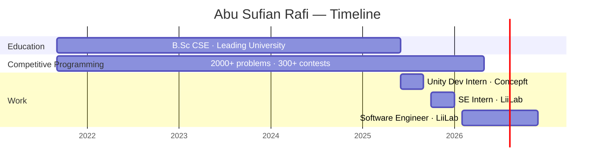

<div align="center">


[](https://git.io/typing-svg)

<br>


[](https://github.com/ASRafi41)
[](https://linkedin.com/in/abu-sufian-rafi/)
[](https://abu-sufian-rafi.vercel.app/)
[](mailto:abusufianrafi326276@gmail.com)

</div>

<br>

```
asrafi41@github:~$ cat profile.txt

  ╔═══════════════════════════════════════════════════════════════╗
  ║  user      →  Abu Sufian Rafi                               ║
  ║  role      →  Software Engineer @ LiiLab                    ║
  ║  location  →  Sylhet, Bangladesh  🇧🇩                       ║
  ╠═══════════════════════════════════════════════════════════════╣
  ║  cp        →  2,000+ problems solved                        ║
  ║  contests  →  300+ online  |  20+ onsite                    ║
  ║  trophy    →  IEEEXtreme 18.0 — #2 Bangladesh  |  #349 🌍  ║
  ╠═══════════════════════════════════════════════════════════════╣
  ║  stack     →  Flutter · Unity · Firebase · MySQL            ║
  ║  langs     →  C++ · Dart · Python · Java · C# · JS · PHP   ║
  ║  edu       →  B.Sc CSE · Leading University · 2025          ║
  ╠═══════════════════════════════════════════════════════════════╣
  ║  status    →  🟢 Open to Work                               ║
  ╚═══════════════════════════════════════════════════════════════╝
```

---

## Tech Stack

<div align="center">

**Languages**


**Frameworks & Platforms**


**Tools**


</div>

---

## Journey



---

## GitHub Stats

<div align="center">


</div>

---

## Competitive Programming

<div align="center">

| | Platform | Profile |
|:-:|---|---|
|  | **Codeforces** | [ASRafi41](https://codeforces.com/profile/ASRafi41) |
|  | **CodeChef** | [asrafi41](https://www.codechef.com/users/asrafi41) |
|  | **LeetCode** | [ASRafi41](https://leetcode.com/ASRafi41) |
|  | **AtCoder** | [ASRafi41](https://atcoder.jp/users/ASRafi41) |

</div>

---

## Activity

<div align="center">


</div>

<br>

<div align="center">

<sub>Abu Sufian Rafi · Sylhet, Bangladesh · abusufianrafi326276@gmail.com</sub>
</div>
